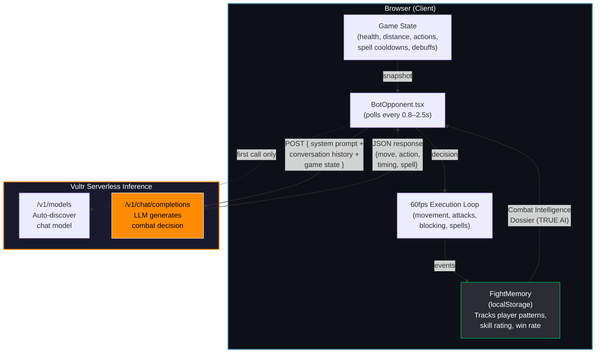
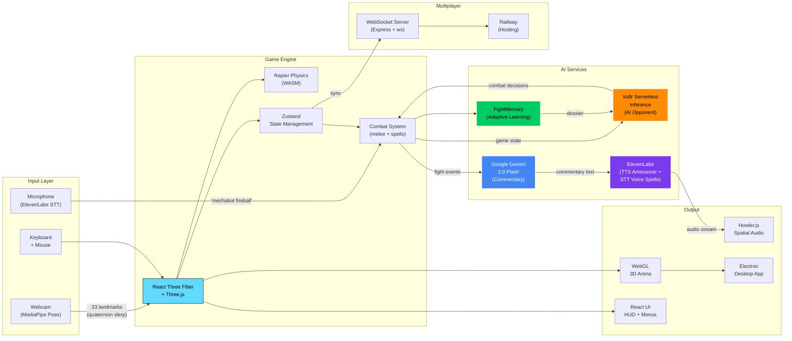

# SUPERMECHAFIGHTER ULTRAREALITY 3600 OF DOOM

Gesture-driven first-person mecha combat. Your body controls the mecha via webcam pose tracking. Fight AI opponents powered by live LLM inference, or battle friends in real-time multiplayer.

## Quick Start

```bash
cd "3js ARENA"
npm install
npm run dev
```

Open the browser and allow camera access. Move your body to control the mecha.

---

## Vultr AI Architecture

The AI opponent ("IRON WRAITH") is powered by **Vultr Serverless Inference**. Every decision — movement, attacks, blocking, and spell casting — is generated live by an LLM on Vultr's GPU infrastructure.



### Decision Flow

1. **BotOpponent** polls `VultrAI.getDecision()` at intervals based on difficulty
2. A **game state snapshot** is built (HP, distance, recent actions, spell cooldowns, debuffs)
3. In **TRUE AI** mode, `FightMemory` injects a **Combat Intelligence Dossier** (player patterns, skill rating, win rate, known combos)
4. The request is sent to Vultr's OpenAI-compatible `/v1/chat/completions` endpoint
5. The LLM returns a JSON decision: `{"move":"strafe_left", "action":"attack", "timing":"immediate", "spell":"laser"}`
6. **BotOpponent** executes the decision at 60fps — movement, sword swings, blocking, and spell casting
7. All events are recorded back to `FightMemory` for the next fight

### Difficulty Modes

| Mode | LLM | Poll Rate | Behavior |
|------|-----|-----------|----------|
| Easy | No | 2.5s | Heuristic only, slow, predictable |
| Medium | Yes | 1.5s | Balanced LLM strategy |
| Hard | Yes | 0.8s | Aggressive, fast reads, low temperature |
| TRUE AI | Yes | 1.0s | Memory-powered, adapts to YOUR patterns across sessions |

---

## Full Tech Stack



### Technologies

| Category | Technology | Purpose |
|----------|-----------|---------|
| **3D Engine** | React Three Fiber + Three.js | WebGL rendering, scene graph |
| **Physics** | Rapier (WASM) | Collision detection, rigid bodies |
| **Computer Vision** | MediaPipe Tasks Vision | 33-landmark body pose tracking |
| **AI Opponent** | Vultr Serverless Inference | LLM-powered combat decisions |
| **AI Commentary** | Google Gemini 2.0 Flash | Dynamic fight commentary generation |
| **Voice** | ElevenLabs | TTS announcer + STT voice-activated spells |
| **State** | Zustand | Client-side state management |
| **Multiplayer** | WebSocket (ws + Express) | Real-time game sync, room matchmaking |
| **Audio** | Howler.js | Spatial audio, sound effects |
| **Particles** | three.quarks | Particle effects (hits, spells, trails) |
| **Desktop** | Electron | Cross-platform desktop distribution |
| **Build** | Vite + TypeScript | Fast HMR, type safety |
| **Hosting** | Railway | WebSocket server deployment |

---

## Project Structure

```
SUPERMECHAFIGHTER ULTRAREALITY 3600 OF DOOM/
├── 3js ARENA/                    # Main game (React + R3F)
│   ├── src/
│   │   ├── ai/                   # Vultr AI + FightMemory
│   │   ├── arena/                # 3D arena environments
│   │   ├── audio/                # Sound manager, ElevenLabs, voice commands
│   │   ├── avatars/              # Mecha geometry builders
│   │   ├── combat/               # Melee, spells, damage, clash detection
│   │   ├── cv/                   # MediaPipe pose tracking pipeline
│   │   ├── entities/             # Player, bot, sword, arms, weapons
│   │   ├── game/                 # Game engine, state, config, customization
│   │   ├── networking/           # WebSocket multiplayer sync
│   │   ├── riggedMechs/          # Rigged mech model loader
│   │   └── ui/                   # HUD, menus, customization panel
│   └── server/                   # WebSocket relay server
└── README.md
```
